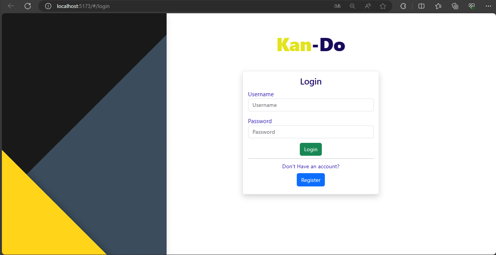
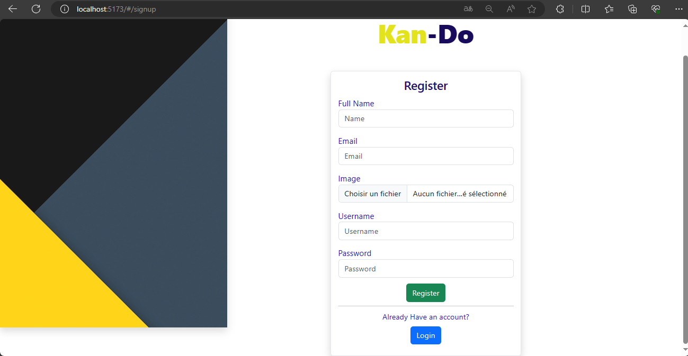
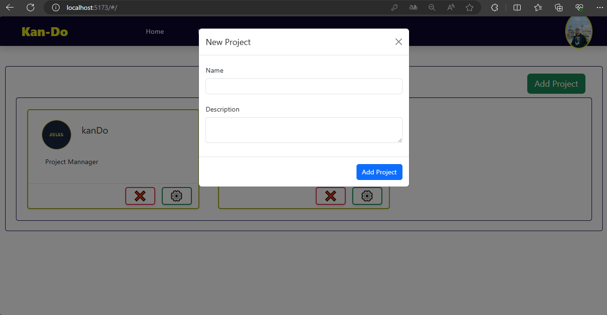
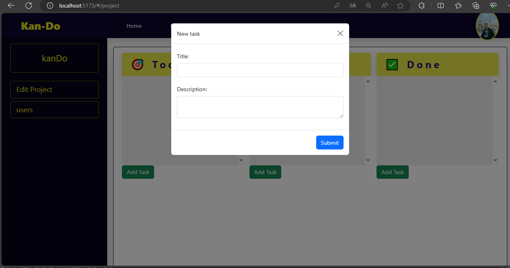
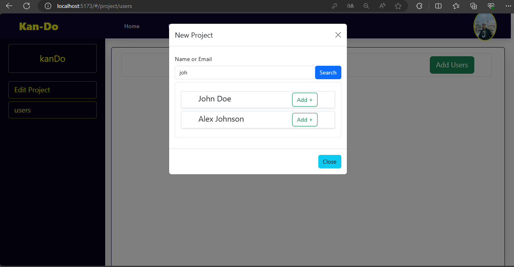

# UniFlow — AI-Assisted Kanban Board

> Fullstack MVP для управления проектами, собранный end-to-end с помощью **Claude Code** и AI-агентов. Дипломный проект с акцентом на быструю декомпозицию, промпт-инжиниринг и контроль качества сгенерированного кода.

[](https://react.dev/)
[](https://vitejs.dev/)
[](https://tailwindcss.com/)
[](https://nodejs.org/)
[](https://sqlite.org/)
[](https://claude.ai/)

🔗 **Live Portfolio:** [semyon-portfolio.vercel.app](https://semyon-portfolio.vercel.app)

---

## 🎯 Почему этот проект важен

Это не просто Kanban-доска — это демонстрация подхода **AI-first development**:

- **Декомпозиция задач:** Проект разбит на 5 фаз (Security → Architecture → UI/UX → Features → Performance). Каждая фаза — результат промпт-инжиниринга и ревью AI-генераций.
- **Промпт-инжиниринг:** Код на React, API, оптимизация SQL-запросов и security-фиксы созданы через итеративные промпты с контекстом всей кодовой базы.
- **Контроль качества:** Все AI-генерации проверены на логику, безопасность (JWT, bcrypt, CORS, валидация) и производительность. N+1 запросы устранены, добавлено кэширование preflight.
- **MVP-мышление:** От идеи до рабочего продукта — минимальный путь, без оверинжиниринга.

---

## 🚀 Фичи

### Управление проектами
- Создание, редактирование и удаление проектов
- Назначение менеджеров и участников команды
- Поиск пользователей по имени / email

### Kanban-доска
- Колонки **Todo → Doing → Done**
- Drag-and-drop перемещение задач
- Фильтрация по статусу, исполнителю, дедлайну
- Поиск по названию и описанию

### Роли и доступ
- **Admin** — полный доступ, управление пользователями
- **Manager** — управление проектами и задачами
- **User** — работа со своими задачами
- JWT-аутентификация с blacklist logout

### Статистика и активность
- Дашборд статистики по проекту (Chart.js)
- Достижения пользователей
- История изменений задач (audit trail)

### UI/UX
- Glassmorphism-дизайн на Tailwind CSS
- Адаптивная вёрстка
- Мультиязычность (EN/RU) через i18next
- Загрузка аватаров с валидацией

---

## 🛠 Технический стек

| Layer | Технологии |
|-------|-----------|
| **Frontend** | React 18, Vite, Tailwind CSS, Chart.js, i18next, React Router DOM |
| **Backend** | Node.js, Express, Sequelize ORM, SQLite |
| **Auth** | JWT (Bearer tokens), bcrypt (8 rounds) |
| **Validation** | express-validator |
| **DevOps** | AI-assisted development (Claude Code) |

---

## ⚡ Быстрый старт

### 1. Установка зависимостей

```bash
cd server && npm install
cd ../client && npm install
```

### 2. Настройка окружения

```bash
# Server
cd server
cp .env.example .env
# Отредактируй .env при необходимости

# Client
cd ../client
cp .env.example .env
```

### 3. Инициализация базы данных

```bash
cd server
npm run db:sync   # Создать таблицы
npm run db:seed   # Заполнить тестовыми данными
```

### 4. Запуск

```bash
# Terminal 1 — Backend
cd server && npm start

# Terminal 2 — Frontend
cd client && npm run dev
```

- **Frontend:** http://localhost:5173
- **Backend API:** http://localhost:3000/api

### 🔐 Тестовые аккаунты

| Роль | Логин | Пароль |
|------|-------|--------|
| Admin | `admin` | `password` |
| Manager | `manager` | `password` |
| User | `user` | `password` |

---

## 🧪 Тестирование

```bash
# Backend tests
cd server && npm test

# Frontend tests
cd client && npm test
```

Покрытие включает:
- **Unit:** Валидация входных данных, утилиты
- **Integration:** API endpoints (auth, projects, tasks)
- **Frontend:** Рендеринг ключевых компонентов

---

## 📊 Оптимизации

| Метрика | Было | Стало | Улучшение |
|---------|------|-------|-----------|
| `getAchievements` | 31 запрос | 3–4 запроса | **10×** |
| `getAll projects` | 11 запросов | 1 запрос | **10×** |
| `getComments` | 3 запроса | 2 запроса | **1.8×** |
| CORS preflight | Без кэша | 24h кэш | **−86%** запросов |

---

## 📁 Структура проекта

```
uniflow-kanban/
├── client/                 # React + Vite frontend
│   ├── src/
│   │   ├── components/     # React компоненты
│   │   ├── api.js          # Централизованный API client
│   │   └── locales/        # EN/RU переводы
│   └── .env.example
├── server/                 # Express backend
│   ├── modules/            # API модули (user, project, task, comment, action)
│   ├── middelwares/        # Auth, RBAC, validation
│   ├── database/           # Sequelize models + seed
│   └── .env.example
├── img/                    # Скриншоты приложения
└── API_ENDPOINTS.md        # Полная документация API
```

---

## 🖼 Скриншоты

### Авторизация


### Регистрация


### Список проектов


### Kanban-доска


### Управление участниками


---

## 📚 API Документация

Полная документация endpoints доступна в файле [`API_ENDPOINTS.md`](API_ENDPOINTS.md).

---

## 🤝 Контакты

- **Portfolio:** [semyon-portfolio.vercel.app](https://semyon-portfolio.vercel.app)
- **Telegram:** [@semyon_v1](https://t.me/semyon_v1)
- **Email:** semyon.v1@gmail.com

Открыт к предложениям по **AI-интеграциям**, **автоматизации** и **fullstack-разработке**.

---

*Проект разработан как дипломная работа в УрФУ с использованием AI-инструментов. Код прошёл ручной ревью на предмет безопасности, логики и зависимостей.*
