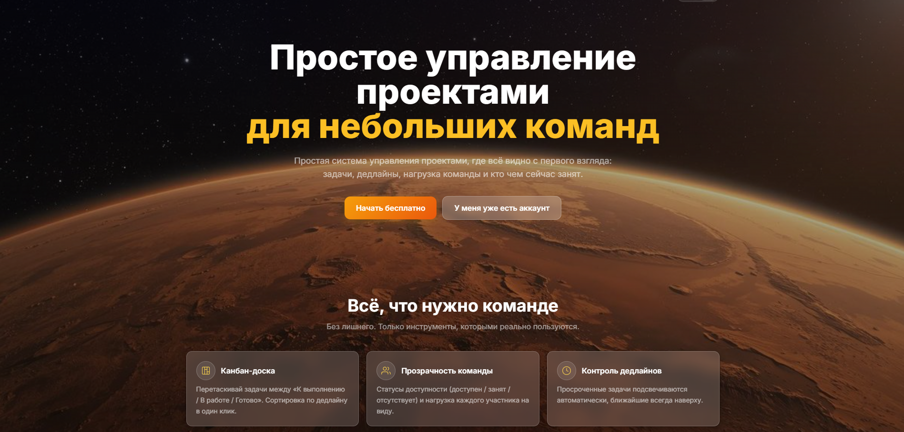
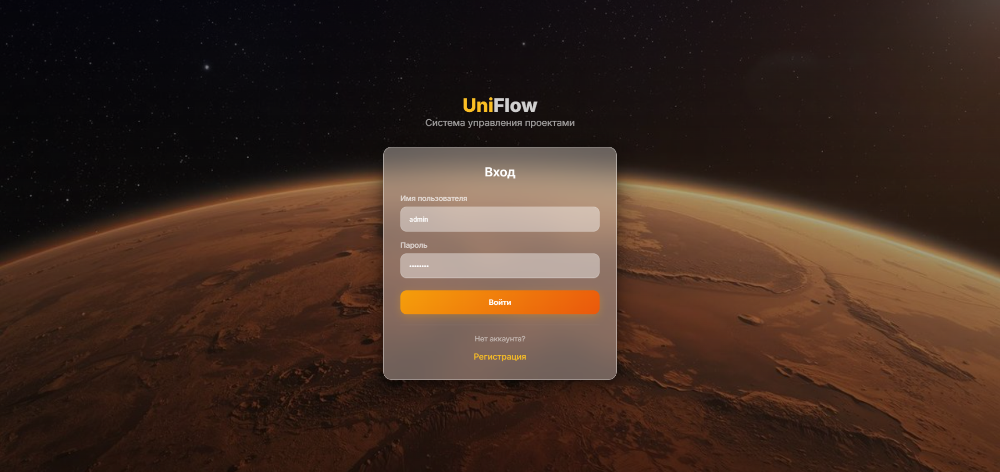

# UniFlow - Kanban Board

> Fullstack MVP для управления проектами, собранный end-to-end с помощью **Claude Code**.

---
Функционал:

### Управление проектами
- Создание, редактирование и удаление проектов
- Назначение менеджеров и участников команды
- Поиск пользователей по имени / email

### Kanban-доска
- Колонки **Todo → Doing → Done**
- Drag-and-drop перемещение задач
- Фильтрация по статусу, исполнителю, дедлайну
- Поиск по названию и описанию

### Роли и доступ
- **Admin** — полный доступ, управление пользователями
- **Manager** — управление проектами и задачами
- **User** — работа со своими задачами
- JWT-аутентификация

### Статистика и активность
- Дашборд статистики по проекту (Chart.js)
- Достижения пользователей
- История изменений задач (audit trail)

### UI/UX
- Glassmorphism-дизайн на Tailwind CSS
- Адаптивная вёрстка
- Мультиязычность (EN/RU) через i18next
- Загрузка аватаров с валидацией

---

## 🛠 Технический стек

| Layer | Технологии |
|-------|-----------|
| **Frontend** | React 18, Vite, Tailwind CSS, Chart.js, i18next, React Router DOM |
| **Backend** | Node.js, Express, Sequelize ORM, SQLite |
| **Auth** | JWT (Bearer tokens), bcrypt (8 rounds) |
| **Validation** | express-validator |
---

## ⚡ Быстрый старт

### 1. Установка зависимостей

```bash
cd server && npm install
cd ../client && npm install
```

### 2. Настройка окружения

```bash
# Server
cd server
cp .env.example .env

# Client
cd ../client
cp .env.example .env
```

### 3. Инициализация базы данных

```bash
cd server
npm run db:sync   # Создать таблицы
npm run db:seed   # Заполнить тестовыми данными
```

### 4. Запуск

```bash
# Terminal 1 — Backend
cd server && npm start

# Terminal 2 — Frontend
cd client && npm run dev
```

- **Frontend:** http://localhost:5173
- **Backend API:** http://localhost:3000/api


---

## 📊 Оптимизации

| Метрика | Было | Стало | Улучшение |
|---------|------|-------|-----------|
| `getAchievements` | 31 запрос | 3–4 запроса | **10×** |
| `getAll projects` | 11 запросов | 1 запрос | **10×** |
| `getComments` | 3 запроса | 2 запроса | **1.8×** |
| CORS preflight | Без кэша | 24h кэш | **−86%** запросов |

---

## 📁 Структура проекта

```
uniflow-kanban/
├── client/                 # React + Vite frontend
│   ├── src/
│   │   ├── components/     # React компоненты
│   │   ├── api.js          # Централизованный API client
│   │   └── locales/        # EN/RU переводы
│   └── .env.example
├── server/                 # Express backend
│   ├── modules/            # API модули (user, project, task, comment, action)
│   ├── middelwares/        # Auth, RBAC, validation
│   ├── database/           # Sequelize models + seed
│   └── .env.example
├── img/                    # Скриншоты приложения
└── API_ENDPOINTS.md        # Полная документация API
```

---

## 🖼 Скриншоты

### Главная страница


### Авторизация


### Kanban-доска


### Статистика проекта


### Дашборд пользователя


---

## 📚 API Документация

Полная документация endpoints доступна в файле [`API_ENDPOINTS.md`](API_ENDPOINTS.md).